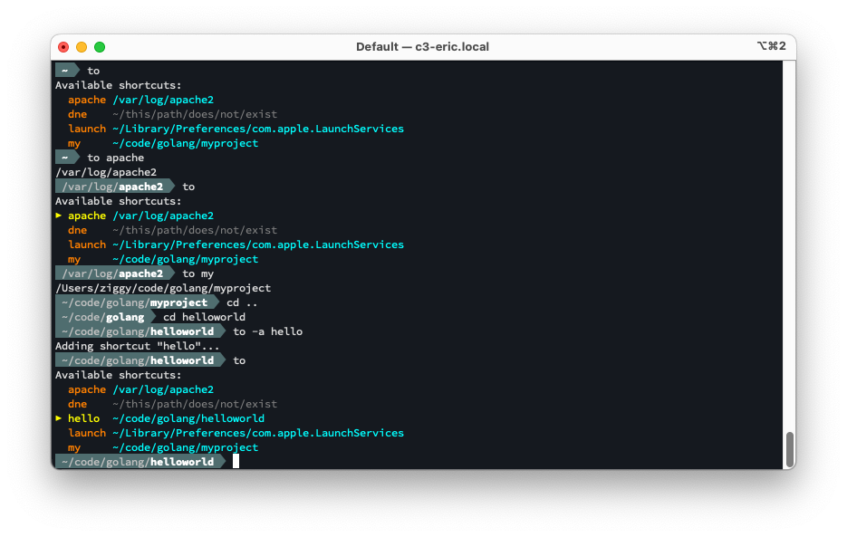

MajorTom is a delightful command line utility for navigating between file path shortcuts. MajorTom is here to get you where you need to go.



### Navigate to a shortcut
`to <shortcut>`

You can also abbreviate the shortcut name (e.g. `to he` for `to helloworld`).

### Add a shortcut (to the current directory)
`to -a <shortcut>`

### Delete an existing shortcut
`to -d <shrotcut>`


## Installation

### Pre-Made Builds

### From Source

```bash
export MAJORTOM_CONFIG="~/.config/majortom/majortom_config.json"
to () {
    result=$(majortom $@ )
    if [[ $result = :* ]]
    then
        # A path was returned (prefixed by ":"). Print it, and then cd to it.
        result="${result:1}"
        echo "$result"
        cd "$result"
    else
        # Print the result if non-blank
        if test "$result"
        then
            echo "$result"
        fi
    fi
}
```

## How to Use

## Configuration File

By default, MajorTom's config file location defaults to `~/.config/majortom/majortom_config.json`.  You can override that by setting the environment variable `MAJORTOM_CONFIG`.  (e.g. `export MAJORTOM_CONFIG=~/my_config_dir/mt.json`).

If you don't yet have a config file, you can create one by running `majortom -init`, which will create a new (blank) config file at the currently configured location.

The `-init` command will never erase/overwrite/clear an existing config file.

## Build

## How it works

