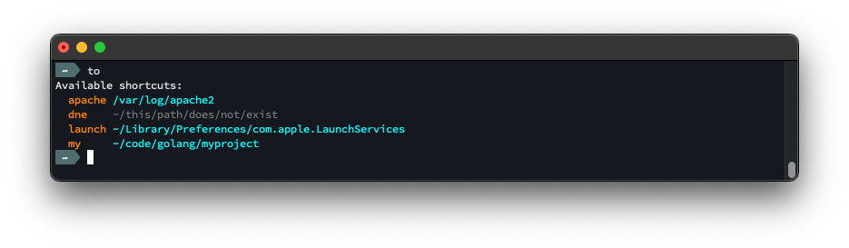
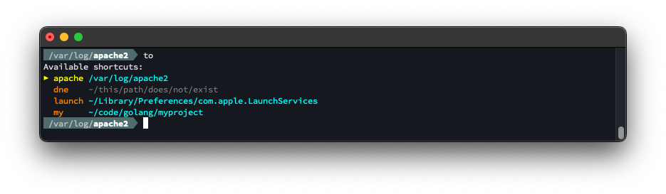
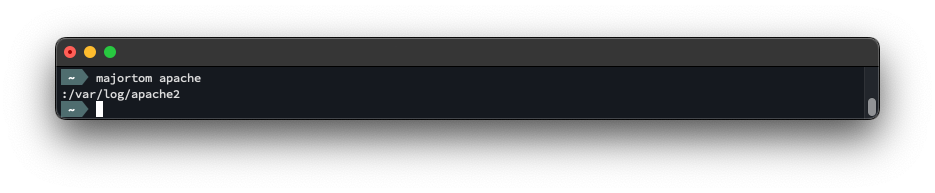

MajorTom is a delightful command line utility for navigating between file path shortcuts.

MajorTom is here to get you where you need to go.


### List shortcuts
Use `to` (with no arguments) to list your current shortcuts.


### Navigate
Use `to <shortcut>` to navigate (change directory) to an existing shortcut.

You can also abbreviate the shortcut name (e.g. `to apa` for `apache2`).


### See where you are
When you run `to` (with no arguments) and you are in a directory for which you have a shortcut, that shortcut will be indicated (yellow, with marker).


### Add a shortcut
Use `to -a <shortcut>` to add a shortcut to the current working directory.


### Delete a shortcut
Use `to -d <shortcut>` to delete an existing shortcut.


## Installation

### Pre-Made Builds

### From Source

```bash
# majortom:start ---------------------------------------------------------------

# To override the default config file name/location uncomment the following line
# and point it to your desired config file. 
# export MAJORTOM_CONFIG="~/.config/majortom/majortom_config.json"

# The to() function runs majortom (with all supplied arguments) and if majortom
# returns a path then cd's to that path.
to () {
    result=$(majortom $@ )
    if [[ $result = :* ]]
    then
        # A path was returned (prefixed by ":"). Print it, and then cd to it.
        result="${result:1}"
        echo "$result"
        cd "$result"
    else
        # Print the result if non-blank
        if test "$result"
        then
            echo "$result"
        fi
    fi
}
# majortom:end -----------------------------------------------------------------
```

## How to Use

## Configuration File

By default, MajorTom's config file location defaults to `~/.config/majortom/majortom_config.json`.  You can override that by setting the environment variable `MAJORTOM_CONFIG`.  (e.g. `export MAJORTOM_CONFIG=~/my_config_dir/mt.json`).

If you don't yet have a config file, you can create one by running `majortom -init`, which will create a new (blank) config file at the currently configured location.

The `-init` command will never erase/overwrite/clear an existing config file.

A typical config file containing a few shortcuts might look like this:

```json
{
    "locations": {
        "apache": "/var/log/apache2",
        "dne": "~/this/path/does/not/exist",
        "hello": "~/code/golang/helloworld",
        "launch": "~/Library/Preferences/com.apple.LaunchServices",
        "my": "~/code/golang/myproject"
    }
}
```

## Build

## How it works
The `to` command (defined in `/dist/resources/shell_init_snippet.sh`) is a shell script function which gets added to your shell init script (`.bahsrc`, `.zshrc`).

`to` calls `majortom` (which gets installed in `/usr/local/bin/majortom`), and if `majortom` returns a path (which it will prefix with `:`) then `to` will `cd` to it.

You can see this behavior if you run `majortom` directly...


...versus running it via `to`...
