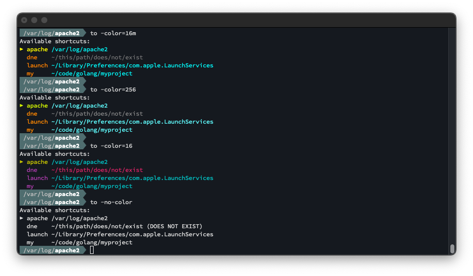

MajorTom provides simple shortcut navigation around your file system.

MajorTom is here to get you where you need to go.

### List shortcuts
Use `to` (with no arguments) to list your current shortcuts.


### Navigate
Use `to <shortcut>` to navigate (change directory) to an existing shortcut.

You can also abbreviate the shortcut name (e.g. `to apa` for `apache`).


### See where you are
When you run `to` (with no arguments) and you are in a directory for which you have a shortcut, that shortcut will be indicated (yellow, with marker).


### Add a shortcut
Use `to -a <shortcut>` to add a shortcut to the current working directory.


### Delete a shortcut
Use `to -d <shortcut>` to delete an existing shortcut.


### Terminal Color Modes
MajorTom defaults to use 16m (24-bit RGB) terminal color codes. It also supports 256/16/no-color modes via the
following command-line options.  

- `-color=16m`
- `-color=256`
- `-color=16`
- `-no-color`

If you want to force a color mode other than the default (`16m`), then add it to the `to()` function
in your `.bashrc`/`.zshrc` like this:

```bash
to () {
    result=$(majortom -color=16 $@)
...
```




## Installation

### Pre-Made Builds

### From Source

```bash
# majortom:start ---------------------------------------------------------------

# To override the default config file name/location uncomment the following line
# and point it to your desired config file. 
# export MAJORTOM_CONFIG="~/.config/majortom/majortom_config.json"

# The to() function runs majortom (with all supplied arguments) and if majortom
# returns a path then cd's to that path.
to () {
    result=$(majortom $@ )
    if [[ $result = :* ]]
    then
        # A path was returned (prefixed by ":"). Print it, and then cd to it.
        result="${result:1}"
        echo "$result"
        cd "$result"
    else
        # Print the result if non-blank
        if test "$result"
        then
            echo "$result"
        fi
    fi
}
# majortom:end -----------------------------------------------------------------
```
## Uninstalling
- Delete the `to()` helper function from your `~/.bashrc` and/or `~/.zshrc`.
    - Delete the lines from:
        -  `# majortom:start -----------------------------------------------------------------` 
    - Through:
        - `# majortom:end -----------------------------------------------------------------`
- Delete the executable:
    - `sudo rm /usr/local/bin/majortom`

## Configuration File

By default, MajorTom's config file location defaults to `~/.config/majortom/majortom_config.json`.  You can override that by setting the environment variable `MAJORTOM_CONFIG`.  (e.g. `export MAJORTOM_CONFIG=~/my_config_dir/mt.json`).

If you don't yet have a config file, you can create one by running `majortom -init`, which will create a new (blank) config file at the currently configured location.

The `-init` command will never erase/overwrite/clear an existing config file.

A typical config file containing a few shortcuts might look like this:

```json
{
    "locations": {
        "apache": "/var/log/apache2",
        "dne": "~/this/path/does/not/exist",
        "hello": "~/code/golang/helloworld",
        "launch": "~/Library/Preferences/com.apple.LaunchServices",
        "my": "~/code/golang/myproject"
    }
}
```

## Build Instructions
_(These instructions presume that you have a working [go](https://go.dev) environment set up on your machine)_

### To build from source
- Clone the repo
- In the repo, run: `./build.sh`
    - Builds will be created in `/dist/builds`
    - zip/tar images will be created in `/dist/images`

### Building for other architectures/processors
The build script creates cross-compiled builds for multiple OS's and processor architectures.  If you need to create a build for different OS or architecture, add a new one to the end of the `.build.sh` script.

For example, this line create a release for the `linux` OS and the `amd64` architecture, and packages the output as a `tar` image:

`do_build linux amd64 tar`

The API of the `do_build()` function is basically `do_build(GOOS, GOARCH, [tar|zip])` so you can pass any `GOOS` or `GOARCH` that `go` [supports](https://go.dev/doc/install/source#environment).

**NOTE**: For clarity the `GOOS` `darwin` is renamed to `macos` when creating build outputs. 

## How it works
The `to` command (defined in `/dist/resources/shell_init_snippet.sh`) is a shell script function which gets added to your shell init script (`.bahsrc`, `.zshrc`).

`to` calls `majortom` (which gets installed in `/usr/local/bin/majortom`), and if `majortom` returns a path (which it will prefix with `:`) then `to` will `cd` to it.

You can see this behavior if you run `majortom` directly...


...versus running it via `to`...
